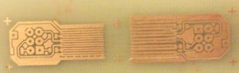
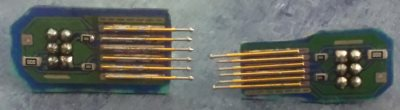
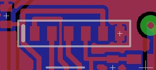
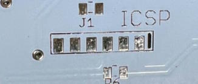

Pogo pin ICSP programming adapter

***

The standard 2x3 ICSP header that is usually used for Arduino/Atmel projects is bulky and requires a wide header on the PCB. For decent sized through-hole projects this may be OK, but I do a lot of SMD boards (much easier since you don't have to drill a bunch of holes).  I found lots of different ideas on the web, and decided to use pogo pins.  In addition, I found a great project that didn't require multiple PCBs to stabilize the pogo pins! Unfortunately, I don't remember who's project that was so I can't give them credit. Just keep in mind this idea was not entirely mine, nor is it unique. That being said, here are a couple pics of the raw PCB and the finished products:

 

There are 2 versions, the first being a "normal" sized board with a pitch of about 1.83mm, the second being a tiny version with a pitch of about 1.27mm. In most cases, I go with the 1.83 pitch board since I can route small traces between the pads. The 1.27mm version is good for those boards with no room to spare, but I have never needed it. The Kicad library only includes the larger 1.83mm pitch footprint. 

Here's an example of using the ICSP pads designed for these pogo adapters:

 

The important part of making these adapters work is to carefully solder the pogo pins in between the long PCB traces on the board. If done correctly, they should sit right in between the traces and be fairly stable while you solder.  I like to have the 2 pins on either end slightly longer than the middle pins, but it isn't really necessary.
